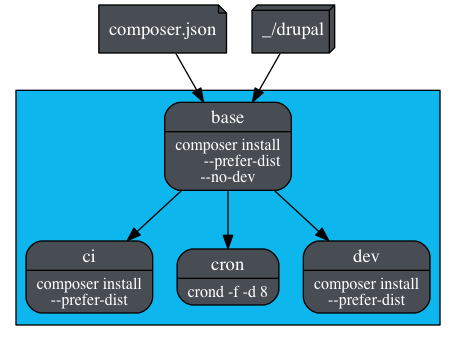
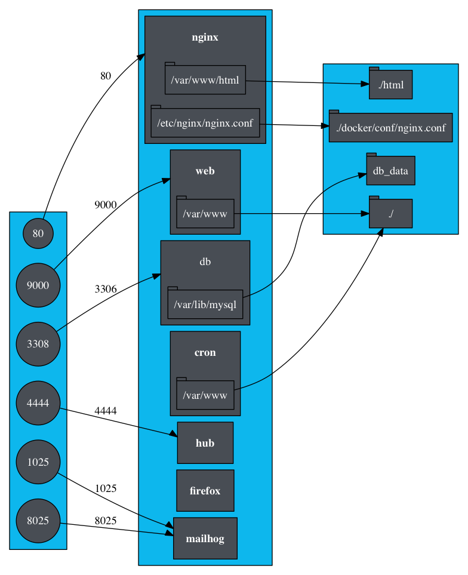

Docker template for Composer + Drupal
=====================================

Provides an barebones, fast, and lightweight local / CI docker environment to
work with Drupal.

## Install + Configuration

### Docker Toolbox

Install [Docker Toolbox][docker-toolbox] which is comprised of the following
tools:

- [Docker Engine][docker-engine]
- [Docker Compose][docker-compose]
- [Docker Machine][docker-machine]
- [Kitematic][kitematic]

It is also highly recommended when using `Docker Machine` you install:

- [Docker Machine NFS][docker-machine-nfs]

> Note: The Docker Toolbox is only one of many methods to get Docker.

### Docker Machine

#### Configure Docker on VirtualBox (Support for proxy bypass)

The use of `$HTTP_PROXY` in this context implies the Host OS has the export.
This is important if you are behind a proxy, else the string will just be NULL
and will be safely ignored.

```sh
  docker-machine create -d virtualbox \
  --engine-env HTTP_PROXY=$HTTP_PROXY \
  --engine-env HTTPS_PROXY=$HTTP_PROXY \
  --engine-env http_proxy=$HTTP_PROXY \
  --engine-env https_proxy=$HTTP_PROXY \
  --engine-storage-driver overlay \
  --virtualbox-cpu-count "4" \
  --virtualbox-memory "12288" \
  site-name
```

> Note: Overlay2 is only supported in OS's with Linux Kernel 4.0+

Create the following in: `/var/lib/boot2docker/bootlocal.sh`

```sh
#!/bin/sh
echo "export HTTP_PROXY=$HTTP_PROXY" >> /home/docker/.ashrc
echo "export HTTPS_PROXY=$HTTP_PROXY" >> /home/docker/.ashrc
echo "export http_proxy=$HTTP_PROXY" >> /home/docker/.ashrc
echo "export https_proxy=$HTTP_PROXY" >> /home/docker/.ashrc
```

Switch between multiple `Docker Machines / Drupal environments` with the
following command:

```sh
eval $(docker-machine env site-name)
```

#### Configure Docker Machine with high speed NFS mounts.

The following command activates NFS for an existing boot2docker box created
through Docker Machine:

```sh
docker-machine-nfs site-name
```

#### Build + Start Docker Machine

All of the Docker containers rely on a composer build. Since this is a first
run the `composer update` command will be executed first. The next command is
to build the base container for this project from which all dependent
containers will derive and then to instantiate the infrastructure.

```sh
composer update
docker-compose build --no-cache
docker-compose up -d
```

> Note: The second step can easily be replaced by a Docker Hub image that is
continuously rebuilt with CI.

## Architecture

Now that all of the infrastructure and pre-requisites have been installed +
built out we can take a moment to go over the file system. The tree represented
below gives a overview of the generated scaffold. All logic is contained within
a single docker folder + 5 controller files. Please note the controller files
will never be regenerated to prevent overrides from being deleted.

```
.
├── docker (folder)
│   ├── bin
│   │   ├── activate
│   │   ├── behat
│   │   ├── composer
│   │   ├── drupal
│   │   ├── drush
│   │   ├── lint
│   │   ├── php
│   │   ├── phpcs
│   │   ├── phpmd
│   │   ├── phpunit
│   │   └── simpletest
│   ├── conf
│   │   ├── console
│   │   ├── drupal
│   │   ├── nginx.conf.ctmpl
│   │   ├── phpcs.xml
│   │   └── phpunit.xml
│   ├── images
│   │   │── 1.0-alpha1 (example of tagged release for Docker Hub)
│   │   │   ├── scripts
│   │   │   │   └── ScriptHandler.php
│   │   │   └── Dockerfile
│   │   ├── ci
│   │   │   ├── Dockerfile
│   │   │   └── php.ini
│   │   ├── cron
│   │   │   ├── Dockerfile
│   │   │   └── tasks
│   │   │       ├── monthly
│   │   │       ├── hourly
│   │   │       ├── daily
│   │   │       └── 15min
│   │   │           └── test
│   │   └── dev
│   │       ├── Dockerfile
│   │       └── php.ini
│   ├── scripts
│   │   └── ScriptHandler.php
│   ├── config.yml
│   ├── deploy.php
│   └── Dockerfile
├── .gitlab-ci.yml        (controller file for GitLab CI)
├── .travis.yml           (controller file for Travis CI)
├── docker-compose.yml    (controller file for Docker)
├── docker-compose-ci.yml (controller file for Docker on CI builds)
└── Makefile              (controller file for Docker)
```

### Composer

The `composer.json` + `scripts/scriptHandler.php` file will be copied
from the project into the `docker` + `docker/images/<release>` folder(s) and is
the primary configuration for the majority of the containers. The image below
gives a rough overview:



### Drupal Scaffold Docker (Composer Plugin)

Overall the bulk of the logic for how the `drupal-scaffold-docker` plugin works
can be gathered from the the `downloadScaffold()` function in the `Handler.php`
file.

- [downloadScaffold()][docker-drupal-scaffold-down]

All the `downloadScaffold()` does is iterate over all of the template
(a.k.a skeleton) files performing token replacement while downloading the
scaffold. The following tokens are given below:

#### Tokens

`{{__ORG__}}`

Replaced by the organization name given in a project's root `composer.json`
file name property.

`{{__PROFILE__}}`

Replaced by the detected installation profile name. This supports detecting the
base installation profile through dependency resolving (`depResolve()`) and
iterating over the `type:drupal-profile` composer configuration property.

`{{__REPO__}}`

Replaced by the repository name given in a project's root `composer.json`
file `name` property.

`{{__REPO_SHORT__}}`

Replaced by the repository name given in a project's root `composer.json`
file `name` property and passed through a custom regex `[^A-Za-z0-9]` filter.

### Bin folder `docker/bin`

You can interact with Drupal and associated tools via the `docker/bin` commands.

```
.
├── activate
├── behat
├── cli
├── composer
├── drupal
├── drush
├── lint
├── php
├── phpcs
├── phpmd
├── phpunit
└── simpletest
```

> Note: The `docker/bin` folder provides idempotent control over a range of
docker services as they are merely wrappers to `docker run`. This `bin` folder
will be useful when configuring PHPStorm to support Behat, Composer, PHP, etc.

The following are some example(s) of commonly used commands to help illustrate
how the `bin` folder can be leveraged:

Call any `drush` command:

```sh
./docker/bin/drush archive-dump --destination="drupal$$(date +%Y%m%d_%H%M%S).tgz"
```

Lint all of the Docker files:

```sh
./docker/bin/lint
```

Run `PHPCS` + `PHPUnit`:

```sh
./docker/bin/phpcs --standard=/var/www/{{__DOCROOT__}}/core/phpcs.xml

./docker/bin/phpunit --colors=always \
                     --testsuite=kernel \
                     --group drupal
```

### Makefile

The makefile corresponding to this project provides a wide array of useful
operations in order to interact with your Drupal site. For instance to install
your composer based Drupal project:

```sh
make drupal_install
```

You can get a full list of Makefile targets by typing:

```sh
make list
```

## Docker Images

Every image (except for MySQL until P.R. is merged) is based on the lightweight
[Alpine][alpine] Linux distribution. Additionally most of the images listed
below are extended off of each other to take advantage of docker layering best
practices. Due to this you will be downloading far less then the listed amounts.
Finally every image in some form or another is directly derived from Docker
official images.

> Note: There are additional tricks such as leveraging a
[docker registry proxy][docker-registry] cache so on rebuilds, you won't need
to download the images when rebuilding etc.

### Images (Official)

| Repository                      | Tag          | Size      |
| ------------------------------- | ------------ | --------- |
| alpine                          | latest       | 3.98  MB  |
| nginx:alpine                    | latest       | 54.27 MB  |
| mailhog/mailhog                 | latest       | 46.56 MB  |
| mysql                           | 5.6          | 327.5 MB  |

#### Alpine

[Alpine][alpine] is the base layer that all of our images leverage. Chosen for
its small size, resource isolation, and memory efficiency. Additionally
[Alpine][alpine] provides a great packager to help with docker layering namely
[apk][apk].

#### Mailhog

[Mailhog][mailhog] is an incredibly light weight email testing tool for
developers build in [go][go]. You can configure the application for SMTP
delivery, view messages in the web UI, or retrieve them with the JSON api.

#### MySQL

The only non alpine image is the MySQL image. Currently it is being worked to
create an [Alpine][alpine] variant much like the PostgreSQL image.

### Helper Images (Extended)

| Repository                      | Tag          | Size      |
| ------------------------------- | ------------ | --------- |
| drupalcomposer/drupal                | latest       | 177.2 MB  |
| drupalcomposer/selenium              | hub          | 155.4 MB  |
| drupalcomposer/selenium              | node-firefox | 326.5 MB  |

- [drupalcomposer/drupal][docker-drupal]

#### Overridden (`_/drupal`)

> Note: The Dockerfile in `drupalcomposer/drupal` extends from the
`drupal:fpm-alpine` container and simply provides missing support. Eventually
this image should be ported to the Docker official library for Drupal.

#### Selenium (Hub + Node Firefox)

A bare bones selenium environment built in [Alpine][alpine]. Contains both the
[Selenium Grid Hub][selenium-grid] and [Selenium Node][selenium-node] images
configured to run firefox.

- [drupalcomposer/selenium][selenium]

#### Namespace change for `Helper Images`

Ideally I would like to change these images to be namespaced under the
`drupal-composer` organization.

| Repository                      | Tag          | Size      |
| ------------------------------- | ------------ | --------- |
| drupal-composer/drupal          | latest       | 177.2 MB  |
| drupal-composer/selenium        | hub          | 155.4 MB  |
| drupal-composer/selenium        | node-firefox | 326.5 MB  |

### Scaffolded Drupal Images derived from `composer.json`

| Repository                      | Tag          | Size                        |
| ------------------------------- | ------------ | --------------------------- |
| org/repo                        | latest       | depends on `composer.json`  |
| sitename_cron                   | latest       | depends on `composer.json`  |
| sitename_web                    | latest       | depends on `composer.json`  |

#### Base (`org/repo`)

This image when built locally or possibly pulled from Docker Hub (if setup) is
a direct extension of the official Drupal image. It simply calls the base layer
and runs the following composer command (amongst others) in the container:

```
composer global require "hirak/prestissimo:^0.3" && \
composer install --prefer-dist \
                 --no-interaction \
                 --no-dev
```

> Note: This layer doesn't include the dev dependencies from `composer.json`

- [Dockerfile][drupal-site-layer]

#### Development (`org/repo_web`)

This image when built or pulled from the `Docker Hub` (if present) is a direct
extension of the `Base` image with the added composer dev dependencies
and `xdebug` as well as a few other important developer tooling.

```
composer install --prefer-dist --no-interaction
```

- [Dockerfile][drupal-site-dev-layer]

#### Cron (`org/repo_cron`)

This image when built is directly extended off of the `Base` image with the
only concern related to carrying out cron tasks.

- [Dockerfile][drupal-site-cron-layer]

#### CI (`org/repo_ci`)

This image when built is directly extended off of the `Base` image with only
the added composer dev dependencies and slightly optimized php.ini settings.

```
composer install --prefer-dist --no-interaction
```

- [Dockerfile][drupal-site-ci-layer]

### Implementations

Currently there are two public GitHub projects using this Docker workflow as
well as a few private ones:

> Note: see the respective `docker` folder and `docker-compose.yml` file):

- [site-wxt][site-wxt]
- [site-open-data][site-open-data]

Tests can be accessed via Travis CI and are simply leveraging docker-compose to
instantiate the infrastructure.

- [site-wxt][travisci-site-wxt]
- [site-open-data][travisci-site-open-data]

### CI Template Files

The specific default templates for both Gitlab CI / Travis CI can be found here:

- [.gitlab-ci.yml][ci-gitlab-ci]
- [.travis-ci.yml][ci-travis-ci]

## Diagram(s)

Below is a `graphviz` dot representation of our `docker-compose.yml` file.



## Acknowledgements

Where possible we try to integrate with the best practices laid out by the
top-tier Drupal projects namely:

* [Lightning][lightning] distribution created by [Acquia][acquia]
* [Open Social][open_social] distribution created by [Goal Gorilla][goalgorilla]

## Tips and Tricks

If you are switching between a lot of projects and / or need to do full
container rebuilds a lot. A great time / bandwidth saver is by setting up a
Docker registry proxy cache. What this does is allow for every docker image
pulled to be transparently saved locally for subsequent docker pulls.

- [Documentation][docker-registry]
- [Repository][docker-registry-proxy-cache]

[acquia]:                       https://acquia.com
[alpine]:                       https://alpinelinux.org
[apk]:                          http://wiki.alpinelinux.org/wiki/Alpine_Linux_package_management
[ci-gitlab-ci]:                 .gitlab-ci.yml
[ci-travis-ci]:                 .travis.yml
[console]:                      https://drupalconsole.com
[consul]:                       https://www.consul.io
[docker-compose]:               https://www.docker.com/products/docker-compose
[docker-engine]:                https://www.docker.com/products/docker-engine
[docker-machine]:               https://www.docker.com/products/docker-machine
[docker-machine-nfs]:           https://github.com/adlogix/docker-machine-nfs
[docker-toolbox]:               https://www.docker.com/products/docker-toolbox
[docker-drupal]:                https://github.com/drupal-composer-ext/drupal
[docker-drupal-scaffold]:       https://github.com/drupal-composer-ext/drupal-scaffold-docker
[docker-drupal-scaffold-down]:  https://github.com/drupal-composer-ext/drupal-scaffold-docker/blob/8.x/src/Handler.php#L104
[docker-registry]:              https://docs.docker.com/registry/recipes/mirror
[docker-registry-proxy-cache]:  https://github.com/sylus/registry-proxy-cache
[drupal-site-layer]:            docker/Dockerfile
[drupal-site-ci-layer]:         docker/images/ci/Dockerfile
[drupal-site-cron-layer]:       docker/images/cron/Dockerfile
[drupal-site-dev-layer]:        docker/images/dev/Dockerfile
[go]:                           https://golang.org
[goalgorilla]:                  https://www.goalgorilla.com/en
[lightning]:                    https://github.com/acquia/lightning
[kitematic]:                    https://www.docker.com/products/docker-kitematic
[mailhog]:                      https://github.com/mailhog/MailHog
[open_social]:                  https://www.drupal.org/project/social
[panopoly]:                     https://github.com/panopoly/panopoly
[registrator]:                  https://github.com/gliderlabs/registrator
[selenium]:                     https://github.com/drupal-composer-ext/selenium
[selenium-grid]:                http://www.seleniumhq.org/projects/grid
[selenium-node]:                https://github.com/SeleniumHQ/selenium
[site-open-data]:               https://github.com/open-data/site-open-data
[site-wxt]:                     https://github.com/drupalwxt/site-wxt
[travisci-site-open-data]:      https://travis-ci.org/open-data/site-open-data
[travisci-site-wxt]:            https://travis-ci.org/drupalwxt/site-wxt
